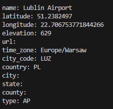
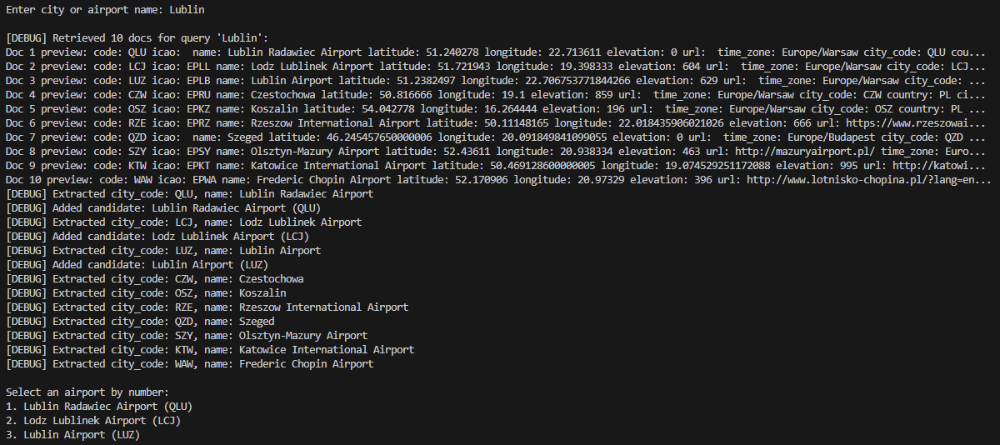
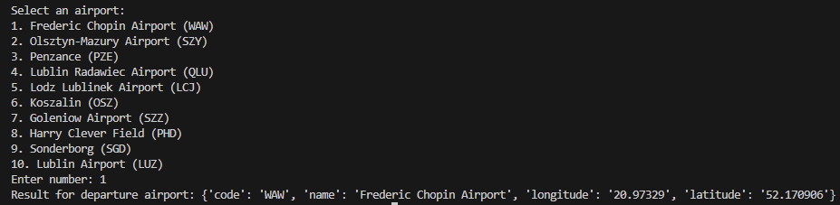
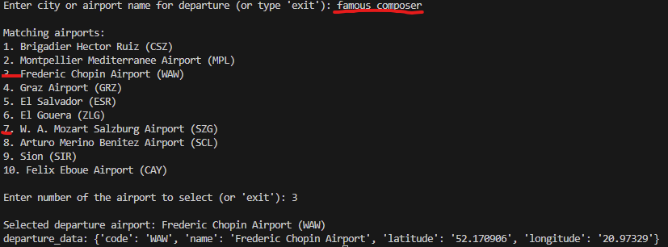
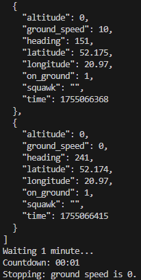
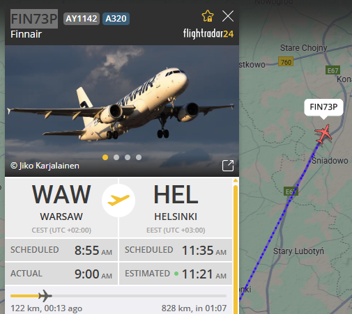
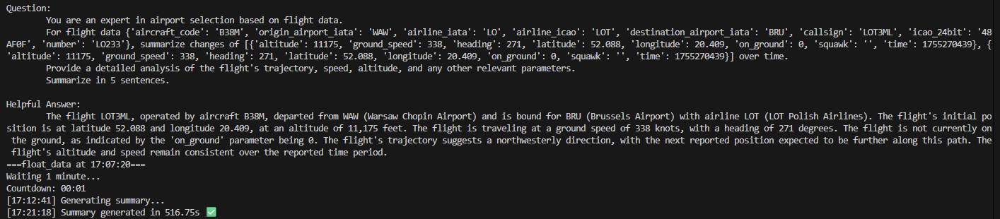

# FLLMaightCon
Console version of FLLMaight
# dependencies
 pip install dotenv
 pip install FlightRadarAPI
 pip install transformers langchain faiss-cpu sentence-transformers
 pip install -U langchain langchain-community
 pip install sentencepiece
 pip install protobuf
 pip install accelerate
 pip install -U langchain langchain-community transformers
 pip install -U langchain-huggingface

# files
airfieldsRAG.py adds airfields data with FAISS
 

 From consoleChat.py we can take an airport candidates based on a city name
 
 
  Departure airport:
 
 
 LLM can uderstand different form of an airpot name :)
 
 
 Flight tracking stops when ground speed = 0 
 
 
 Continues flight tracking
 
 JSON results from the entire flight tracking <a href="./backend/JSONS/FIN73P.json" > here</a>
<h1>The Results</h1>
<ul>
  <li>Mistral 7B downloaded from Hugingface and installed locally
  <li>Mistral 7B running locally on the PC.</li>
  <li>RAG with Airfields data employed and stored locally using FAISS.</li>
  <li>Unofficial SDK for FlightRadar24 API is used.</li>
  <li>Leapfrog method applied for plane tracking using coordinates.</li>
  <li>Flight jumps are stored in JSON format.</li>
  <li>Command-line interface supports "memory chat" for the LLM.</li>
  <li><b>LLM interprets real-time flight tracking data.</b></li>
  <li>CPU and RAM are fully loaded; intended for non-critical testing only.</li>
</ul>
 The example:
 
 
<h1>The Pipeline</h1>
 <i>Due to CPU/RAM restrictions the pipeline was separated in a code</i>
<ol>
  <li>Enter an airport name or text related to an airport into the chat.</li>
  <li>Select an airport from the list.</li>
  <li>Select a flight within the specified range from the chosen airport.</li>
  <li>Select a time frame for flight updates.</li>
  <li>Start tracking the selected flight.</li>
  <li>Receive text information about the flight via the chat.</li>
  <li>When the plane has landed (ground speed = 0), stop tracking.</li>
</ol>

